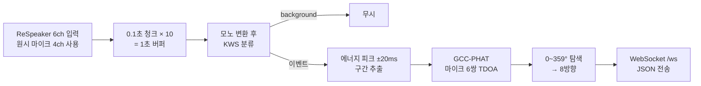

# DeafAssist AI Server — 엣지 실시간 소리 분류 · 방향 추정 서버

> 라즈베리파이에 연결한 ReSpeaker 4-Mic Array로 **위험 소리를 분류(Keyword Spotting)하고 GCC-PHAT으로 8방향을 추정**한 뒤, WebSocket으로 모바일 앱에 실시간 전송하는 엣지 AI 서버입니다.


| 항목 | 내용 |
|---|---|
| 기간 | 2026.03 ~ 2026.06 |
| 유형 | 심화 캡스톤디자인 (팀 프로젝트) |
| 내 역할 | 팀장 · AI 서버 개발 (모델 파인튜닝은 팀원과 공동) |
| 상위 프로젝트 | [hearing-assistant](https://github.com/alberione1110/hearing-assistant): 시스템 전체 구조와 백엔드 |

---

## 핵심 기능

1. **소리 분류 (KWS)**: 8개 클래스(background, call, shout, crying, car_horn, dog_bark, knock, alarm). 클래스별로 다른 임계값을 적용해 오탐을 줄임
2. **방향 추정 (GCC-PHAT)**: 마이크 6쌍의 도달 시간차(TDOA)로 0~359° 중 오차가 가장 작은 각도를 찾아 8방향으로 변환
3. **실시간 전송**: 앱이 `start`/`stop` 메시지로 추론을 제어하고, 결과를 JSON으로 즉시 수신
4. **위험 소리 표시**: 위험 라벨이면 `is_risk: true`로 구분해 전송
5. **Windows와 라즈베리파이 공용 코드**: Windows에서 개발·검증한 코드를 수정 없이 라즈베리파이에 배포해 실행

<!-- 스크린샷/GIF 자리: 하드웨어 사진, 터미널 추론 로그, 앱 수신 화면 -->

---

## 처리 파이프라인



### 설계 포인트
- **분류 결과가 background이면 방향 추정을 건너뜁니다.** 이벤트가 있을 때만 GCC-PHAT을 계산합니다.
- **이벤트 사이에 최소 1초 간격을 둡니다.** 같은 소리로 알림이 연달아 가는 것을 막습니다.
- **추론은 별도 스레드에서 돕니다.** 마이크 읽기와 추론은 스레드에서 실행하고 결과는 `Queue`로 넘겨, WebSocket 이벤트 루프가 막히지 않게 했습니다.

### 메시지 형식

```jsonc
// 앱 → 서버
{ "type": "start" }

// 서버 → 앱
{
  "type": "inference",
  "label": "car_horn",
  "score": 0.94,
  "direction": "front_left",
  "is_risk": true,
  "timestamp": 1713420000
}
```

---

## 기술 스택

| 영역 | 기술 |
|---|---|
| Server | FastAPI (WebSocket), Uvicorn |
| Model | PyTorch, Hugging Face Transformers (`AutoModelForAudioClassification`) |
| Signal | NumPy (GCC-PHAT), sounddevice |
| Hardware | Raspberry Pi, ReSpeaker 4-Mic Array |

---

## 내가 맡은 일
- 마이크 스트림 → KWS → GCC-PHAT → WebSocket으로 이어지는 추론 파이프라인 구현
- FastAPI WebSocket 서버 구현: start/stop 제어, 추론 스레드와 Queue 연동, 결과 포맷 정규화(방향 코드 → `front_left` 등)
- Windows와 라즈베리파이에서 같은 코드가 동작하도록 작성하고 라즈베리파이에 배포
- KWS 모델 파인튜닝 (팀원과 공동)

---

## 실행 방법

### 1) 공통 준비
```bash
git clone https://github.com/alberione1110/deafassist_ai_server.git
cd deafassist_ai_server
python -m venv .venv
```

| OS | 가상환경 활성화 | 추가 준비 |
|---|---|---|
| Windows (PowerShell) | `.\.venv\Scripts\Activate.ps1` | - |
| Raspberry Pi (Linux) | `source .venv/bin/activate` | `sudo apt install libportaudio2` (sounddevice 의존성) |

```bash
pip install -r requirements.txt
```
> 첫 실행 때 Hugging Face Hub에서 모델을 내려받으므로 인터넷 연결이 필요합니다.

### 2) ReSpeaker 장치 번호 확인
```bash
python -c "import sounddevice as sd; print(sd.query_devices())"
```
출력된 ReSpeaker 번호를 `kws_doa/mic_stream.py`의 `DEVICE_INDEX`에 적습니다.

### 3) 모델 단독 테스트
```bash
python -m kws_doa.run
# result: {'label': 'car_horn', 'direction': 'FL', 'score': 0.94, ...}
```

### 4) 서버 실행
```bash
uvicorn app.main:app --host 0.0.0.0 --port 8001
curl http://127.0.0.1:8001/health
```
앱은 같은 네트워크에서 `ws://<디바이스 IP>:8001/ws`로 접속합니다.

---

## 폴더 구조

```text
deafassist_ai_server/
├─ app/
│  ├─ main.py               # FastAPI 앱, /health
│  ├─ ws.py                 # WebSocket /ws (start/stop, 결과 전송)
│  ├─ config.py             # 위험 라벨 목록
│  ├─ schemas.py
│  └─ services/
│     ├─ audio_worker.py    # 마이크 → 파이프라인 실행 스레드
│     └─ result_formatter.py
├─ KWS/kws_infer.py         # 소리 분류 모델 추론
├─ kws_doa/
│  ├─ mic_stream.py         # ReSpeaker 입력 스트림
│  ├─ KwsDoa.py             # 버퍼링 · 이벤트 구간 추출 · 파이프라인
│  ├─ gcc_phat.py           # GCC-PHAT · 방향 추정
│  └─ run.py                # 단독 테스트
└─ requirements.txt
```

## 관련 논문
- 「실시간 소리 인식 및 방향 추정을 활용한 청각장애인 생활 보조 시스템 설계 및 구현」, 한국정보기술학회, 2026 (공동 1저자) <!-- 링크 확인 필요 -->
